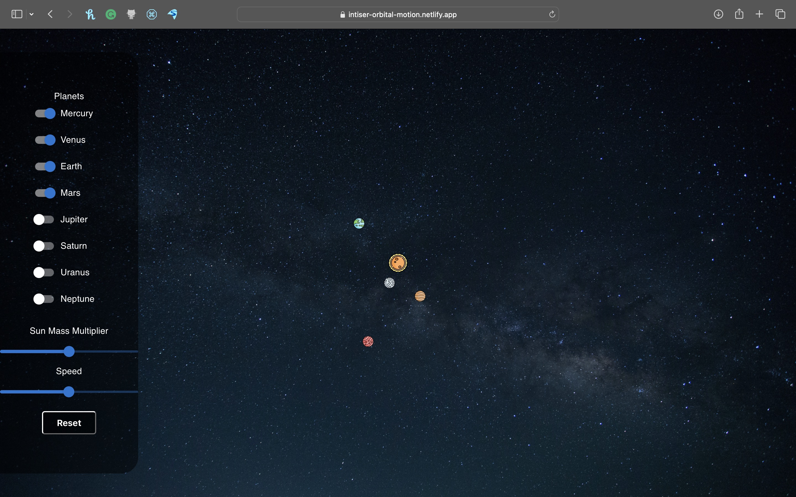

# [Orbital Motion](https://intiser-orbital-motion.netlify.app)

### Author: Intiser Parash

This is a simple program that simulates the motion of planet(s) around a central body (star). The program uses Euler's method to calculate the motion (distance and velocity) of the planet(s) and displays the orbital motion in a graphical interface. The speed of the simulation and the mass of the sun can be multiplied by a factor to speed up the simulation or to make the sun more massive. The program also allows the user to add more planets to the simulation. The math function and constants used are in `math.js` and `constants.js` respectively. 

The distance of the planets are taken from [NASA](https://nssdc.gsfc.nasa.gov/planetary/factsheet/). It is seen that the planets after Mars aren't visible unless the app is zoomed out or is seen on a large display because they are too far out if kept in scale.  

### References
- [Euler's method](https://en.wikipedia.org/wiki/Euler_method)
- [Orbital Motion Implementation with JS](https://evgenii.com/blog/earth-orbit-simulation)

